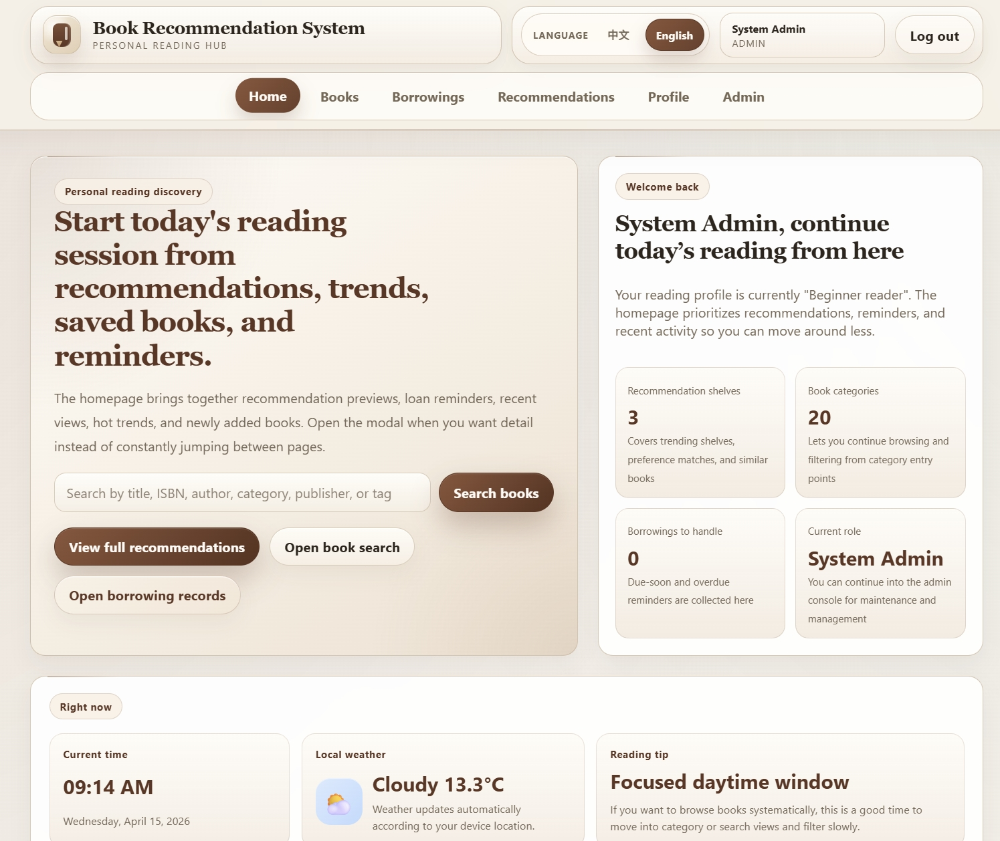
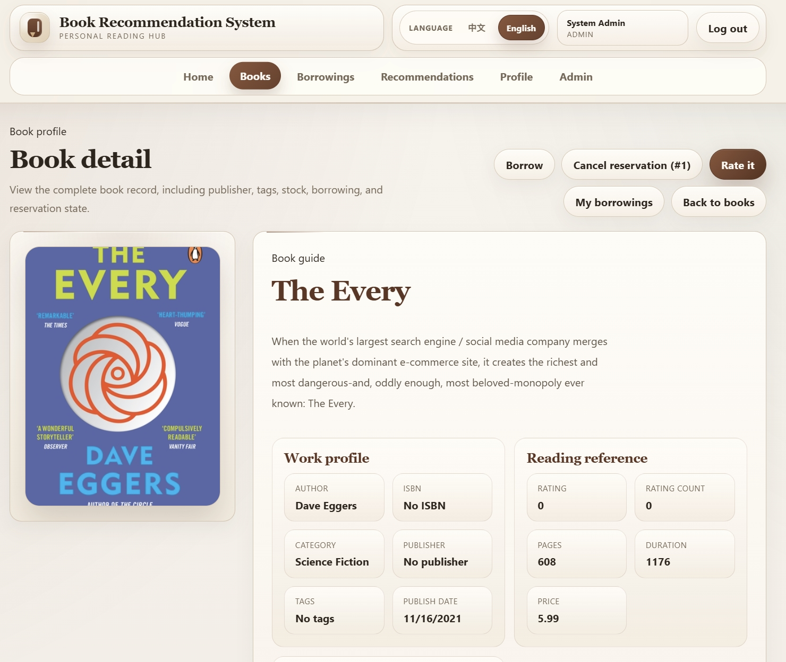
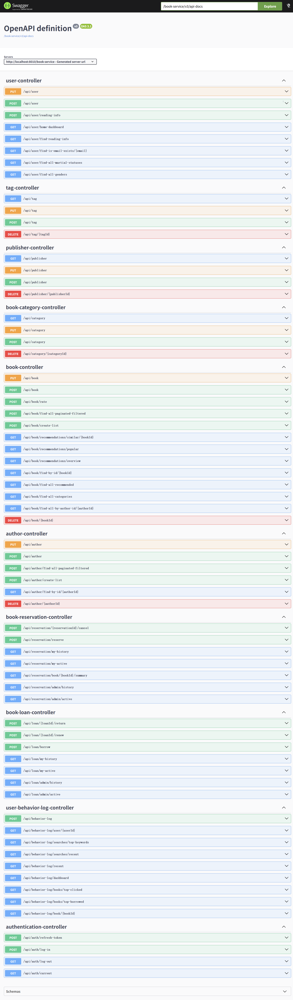

# ReadSeek: Intelligent Discovery System for Reading Resources

**ReadSeek** is a Java Web system for discovering reading resources.  
The current demo uses **book data** as the primary resource type and focuses on showcasing:

- natural-language hybrid retrieval,
- explainable recommendation,
- borrowing and circulation workflows,
- user behavior analytics.

**ReadSeek** 是一个面向阅读资源发现的 Java Web 系统。  
当前版本以**图书数据**作为主要演示资源类型，重点展示**自然语言混合检索、可解释推荐、借阅流通与用户行为分析**的能力。

---

## Research Title / 项目完整题目


Research and System Implementation of Natural-Language Hybrid Retrieval,
Evidence-Driven Question Answering, and Explainable Recommendation
for Reading Resource Discovery

面向阅读资源发现的自然语言混合检索、证据驱动问答与可解释推荐关键技术研究与系统实现


---

## Project Positioning / 项目定位

This version is designed for:

* graduation project demonstrations,
* Java Web course projects,
* backend portfolio showcases.

It already covers the core workflow of:

* resource discovery,
* search,
* recommendation,
* borrowing,
* reservation,
* rating,
* administration.

It also integrates **Elasticsearch / BM25**, while providing a **minimal vector retrieval skeleton** and a **Python AI service stub** for future extension.

> **Important:** Evidence-driven QA and production-grade embedding models are **not fully implemented** in the current version. They should be treated as future work rather than finished production features.

本版本适合：

* 毕业设计演示，
* Java Web 课程项目，
* 后端作品集展示。

当前已经实现**资源发现、检索、推荐、借阅、预约、评分、后台管理**等核心流程，
并接入 **Elasticsearch / BM25**，同时提供**向量检索骨架**与 **Python AI 服务最小集成**。

> **说明：** 证据驱动问答与真实生产级 embedding 模型仍属于后续扩展，当前版本**不应被理解为已完整生产化实现**。

---

## Features / 已实现能力

### 1. Resource and User Workflows / 资源与用户业务

* User registration, login, JWT authentication, and role-based access control.

* Resource listing, detail view, rating, borrowing, returning, renewal, and reservation.

* Admin-side maintenance for resources, authors, categories, publishers, tags, borrow records, reservations, and behavior data.

* User behavior logging, including search actions, detail clicks, and recommendation clicks.

* 用户注册、登录、JWT 鉴权、角色权限控制。

* 阅读资源列表、详情、评分、借阅、归还、续借和预约。

* 管理端可维护资源、作者、分类、出版社、标签、借阅、预约和行为数据。

* 用户行为日志，包括搜索、详情点击和推荐点击。

### 2. Search and Recommendation / 检索与推荐

* PostgreSQL exact match and structured filtering.

* Elasticsearch BM25 full-text search.

* Hybrid retrieval API: exact match + BM25 + vector semantic skeleton.

* Chinese query expansion rules, including common categories, natural-language intents, and author aliases.

* Automatic search index synchronization on create, update, and logical delete.

* Recommendation overview, popular resources, similar resources, and collaborative filtering recommendations.

* PostgreSQL 精确匹配与结构化筛选。

* Elasticsearch BM25 全文检索。

* 混合检索接口：精确匹配 + BM25 + 向量语义骨架。

* 中文查询扩展规则，包括常见分类、自然语言意图和作者别名。

* 资源在创建、更新、逻辑删除时自动同步搜索索引。

* 推荐概览、热门资源、相似资源与协同过滤推荐。

### 3. Engineering and Delivery / 工程化能力

* Dockerfile and Docker Compose support.

* One-click startup scripts for Windows.

* Swagger UI / OpenAPI integration.

* Spring Boot Actuator endpoints for `health`, `info`, and `metrics`.

* Basic GitHub Actions CI for testing and packaging.

* 提供 Dockerfile 与 Docker Compose。

* 提供 Windows 一键启动脚本。

* 集成 Swagger UI / OpenAPI。

* 提供 Actuator `health`、`info`、`metrics` 基础观测端点。

* 提供 GitHub Actions 基础 CI（测试与打包）。

---

## Screenshots / 系统截图

### Home Dashboard / 首页仪表盘



### Search Workspace / 检索工作台


### Resource Detail / 资源详情



### Recommendation Shelf / 推荐书架


### Borrowing Records / 借阅记录


### Swagger UI



---

## Roadmap and Future Work / 未完成或后续扩展

The following items are **research directions or future enhancements** and are **not fully implemented** in the current version:

* production-grade embedding model integration and retrieval quality tuning,
* RAG-based evidence retrieval and answer generation,
* evidence-driven QA with source citation,
* systematic evaluation datasets for search, recommendation, and QA,
* production-grade governance such as distributed rate limiting, tracing, and vulnerability scanning.

以下内容属于**研究方向或后续增强**，**不代表当前版本已完整实现**：

* 真实生产级 embedding 模型接入与检索质量优化，
* RAG 证据检索与答案生成，
* 带引用来源的证据驱动问答，
* 系统化的检索、推荐与问答评测集，
* 分布式限流、Tracing、漏洞扫描等生产级治理能力。

---

## Tech Stack / 技术栈

* Java 17
* Spring Boot 3.5.7
* Spring Web / Spring Security
* Spring Data JPA
* Spring Data Elasticsearch
* PostgreSQL
* Elasticsearch 8
* Liquibase
* MapStruct / Lombok
* springdoc OpenAPI / Swagger UI
* Spring Boot Actuator
* Python 3 local AI service
* Docker / Docker Compose

---

## Project Structure / 项目结构

```text
src/main/java/com/weidonglang/readseek/
  ReadSeekApplication.java
  config/
  controller/
  dao/
  dto/
  entity/
  enums/
  exception/
  manager/
  recommender/
  repository/
  search/
  security/
  service/
  transformer/

src/main/resources/
  application.properties
  db/readseek.xml
  static/ui/

ai-service/
docs/
scripts/
.github/workflows/
```

---

## Quick Start / 快速启动

### Option A: One-click startup on Windows / 方式 A：Windows 一键启动

Double-click the following file in the project root:

```text
start-readseek.bat
```

Or run it in PowerShell:

```powershell
.\start-readseek.bat
```

The script will start:

* PostgreSQL: `localhost:5043`
* Elasticsearch: `localhost:9200`
* Python AI service: `http://127.0.0.1:8001`
* Spring Boot: `http://localhost:8010/readseek-service`
* Default browser page: `http://localhost:8010/readseek-service/ui/login.html`

脚本会自动启动：

* PostgreSQL: `localhost:5043`
* Elasticsearch: `localhost:9200`
* Python AI service: `http://127.0.0.1:8001`
* Spring Boot: `http://localhost:8010/readseek-service`
* 默认浏览器页面：`http://localhost:8010/readseek-service/ui/login.html`

Common options / 常用参数：

```powershell
.\start-readseek.bat -NoAi
.\start-readseek.bat -NoBrowser
.\start-readseek.bat -StartPage home
.\start-readseek.bat -StartPage search
.\start-readseek.bat -StartPage swagger
.\start-readseek.bat -DbPassword 20041117
.\start-readseek.bat -JavaHome "C:\Users\WDL\.jdks\ms-17.0.18"
```

If startup or login fails, run the diagnostic script:

```powershell
powershell -ExecutionPolicy Bypass -File .\scripts\diagnose-readseek.ps1
```

若启动或登录异常，可运行诊断脚本：

```powershell
powershell -ExecutionPolicy Bypass -File .\scripts\diagnose-readseek.ps1
```

---

### Option B: Manual development startup / 方式 B：手动开发启动

Start dependencies and the backend together:

```powershell
.\start-dev.bat -WithAi
```

Or start the AI service separately:

```powershell
.\start-ai-service.bat
```

可通过以下方式手动启动开发环境：

```powershell
.\start-dev.bat -WithAi
```

或单独启动 AI 服务：

```powershell
.\start-ai-service.bat
```

---

### Option C: Start the full application with Docker / 方式 C：Docker 启动完整应用

```powershell
docker compose up --build
```

---

## Default Accounts and Local Configuration / 默认账号与本地配置

### Default admin account / 默认管理员账号

* Email: `admin@booknook.local`
* Password: `Admin123!`

### Default Docker database settings / 默认 Docker 数据库配置

* Database: `book_recommendation_system`
* Username: `postgres`
* Password: `20041117`

### Notes / 说明

* The current database name remains `book_recommendation_system` to preserve compatibility with existing local volumes.

* If your existing local PostgreSQL volume uses a different password, override it with `-DbPassword`.

* 当前数据库名保留为 `book_recommendation_system`，用于兼容已有本地数据卷。

* 如果旧数据卷的 PostgreSQL 密码不同，可通过 `-DbPassword` 覆盖。

---

## Common URLs / 常用地址

```text
Frontend:
http://localhost:8010/readseek-service/ui/login.html

Swagger UI:
http://localhost:8010/readseek-service/swagger-ui/index.html

Actuator Health:
http://localhost:8010/readseek-service/actuator/health

Actuator Info:
http://localhost:8010/readseek-service/actuator/info

Actuator Metrics:
http://localhost:8010/readseek-service/actuator/metrics
```

---

## Build / 打包

Build the project:

```powershell
.\mvnw.cmd clean package
```

Generated artifact:

```text
target/readseek-0.0.1-SNAPSHOT.jar
```

Package without running tests:

```powershell
.\mvnw.cmd -DskipTests package
```

项目打包命令如下：

```powershell
.\mvnw.cmd clean package
```

跳过测试打包：

```powershell
.\mvnw.cmd -DskipTests package
```

---

## Search Index and Hybrid Retrieval Verification / 搜索索引与混合检索测试

Rebuild the search index after startup:

```powershell
powershell -ExecutionPolicy Bypass -File .\scripts\rebuild-search-index.ps1
```

Verify hybrid retrieval with English query:

```powershell
powershell -ExecutionPolicy Bypass -File .\scripts\verify-hybrid-search.ps1 -Query "Pride and Prejudice"
```

Verify hybrid retrieval with Chinese natural-language query:

```powershell
powershell -ExecutionPolicy Bypass -File .\scripts\verify-hybrid-search.ps1 -Query "想看简奥斯汀的代表作"
```

When the AI service is enabled and the index has been rebuilt, the retrieval strategy will display:

```text
hybrid-v2(exact-db+bm25+vector)
```

启动后可通过以下脚本重建索引并验证混合检索：

```powershell
powershell -ExecutionPolicy Bypass -File .\scripts\rebuild-search-index.ps1
powershell -ExecutionPolicy Bypass -File .\scripts\verify-hybrid-search.ps1 -Query "Pride and Prejudice"
powershell -ExecutionPolicy Bypass -File .\scripts\verify-hybrid-search.ps1 -Query "想看简奥斯汀的代表作"
```

当 AI 服务启用且索引已重建时，检索策略会显示：

```text
hybrid-v2(exact-db+bm25+vector)
```

---

## Main APIs / 主要 API

### Resource discovery APIs / 资源发现接口

```text
GET  /api/resources/{resourceId}
POST /api/resources/search
GET  /api/resources/recommended
GET  /api/resources/recommendations/popular
GET  /api/resources/recommendations/overview
GET  /api/resources/recommendations/similar/{resourceId}
GET  /api/resources/categories
GET  /api/search/resources?q=...&limit=...
GET  /api/search/resources/bm25?q=...&limit=...
POST /api/search/index/resources/rebuild
```

Legacy `/api/book/...` and `/api/search/books...` endpoints are still preserved for compatibility,
but all new pages and documentation prefer the **resource-discovery API naming**.

旧的 `/api/book/...` 和 `/api/search/books...` 接口仍保留兼容，
但新页面和新文档优先使用**资源发现语义接口**。

---

## Python AI Service / Python AI 服务

The current Python AI service is a **minimal integration stub** mainly used to validate the call chain from the Java backend to the embedding service.

Current endpoints:

* `GET /health`
* `POST /embed`

Current embedding backend:

* deterministic `hash-bow`
* suitable for integration testing and workflow validation
* **not** representative of the final semantic retrieval quality

当前 Python AI 服务是一个**最小集成骨架**，主要用于验证 Java 后端到 embedding 服务的调用链。

当前提供接口：

* `GET /health`
* `POST /embed`

当前 embedding 后端：

* deterministic `hash-bow`
* 适合联调和流程验证
* **不代表最终语义检索模型质量**

More details / 更多说明：

* [ai-service/README.md](ai-service/README.md)
* [docs/vector-retrieval-ai-service-plan.md](docs/vector-retrieval-ai-service-plan.md)
* [docs/vector-local-test-checklist.md](docs/vector-local-test-checklist.md)

---

## CI / 持续集成

GitHub Actions workflow:

```text
.github/workflows/ci.yml
```

Current quality gates:

* JDK 17
* Maven dependency cache
* `./mvnw -q test`
* `./mvnw -q -DskipTests package`

当前 CI 质量门禁包括：

* JDK 17
* Maven 依赖缓存
* `./mvnw -q test`
* `./mvnw -q -DskipTests package`

---

## Development Notes / 开发说明

### When restart is required / 什么时候需要重启

* If you modify Java backend code, restart the backend.

* If you modify Python AI service code, restart the AI service.

* If you change index structure or embedding write logic, restart the backend **and** rebuild the search index.

* If you only modify static frontend assets, hard-refresh the browser; if needed, run `mvn process-resources`.

* 修改 Java 后端代码：重启后端。

* 修改 Python AI 服务代码：重启 AI 服务。

* 修改索引结构或 embedding 写入逻辑：重启后端并重建搜索索引。

* 只修改静态前端资源：强刷浏览器，必要时执行 `mvn process-resources`。

### Frequently used commands / 常用命令

```powershell
.\start-readseek.bat
```

```powershell
powershell -ExecutionPolicy Bypass -File .\scripts\diagnose-readseek.ps1
```

```powershell
powershell -ExecutionPolicy Bypass -File .\scripts\rebuild-search-index.ps1
```

```powershell
.\mvnw.cmd test
```

---

## Version Boundary / 版本边界

This version is a **stable local-demo release** intended for graduation projects and portfolio demonstrations.

It already provides:

* a complete business workflow for a reading resource discovery system,
* a workable hybrid retrieval engineering skeleton,
* a usable recommendation and borrowing pipeline.

However, it is **not a production-grade system**.
A production-ready version would still require:

* real embedding models,
* a complete RAG-based QA pipeline,
* systematic evaluation,
* distributed rate limiting,
* full observability,
* stronger security governance.

当前版本是一个面向**毕设与本地演示**的稳定版本。

它已经具备：

* 阅读资源发现系统的完整业务闭环，
* 混合检索的工程骨架，
* 可运行的推荐与借阅流程。

但它**不是生产级系统**。
如果要进一步生产化，仍需补充：

* 真实 embedding 模型，
* 完整的 RAG 问答链路，
* 系统化评测，
* 分布式限流，
* 完整可观测性，
* 更强的安全治理能力。

---

## License

See [LICENSE](LICENSE).
