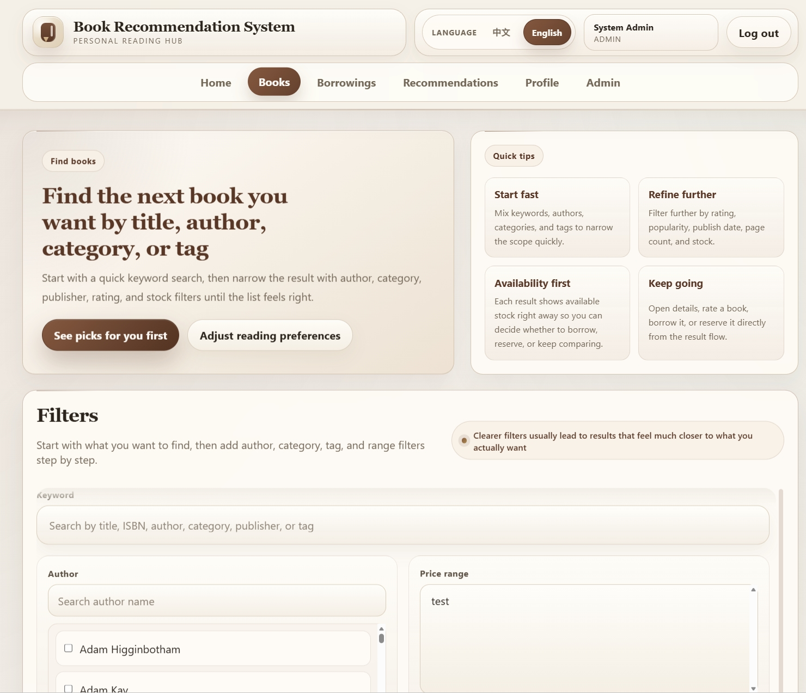
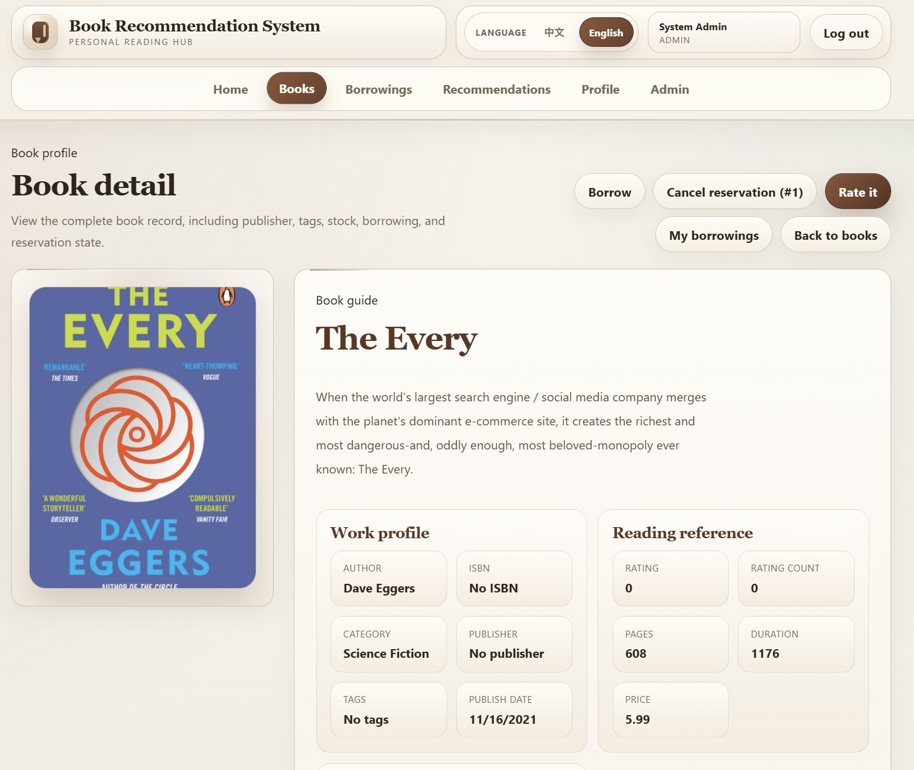
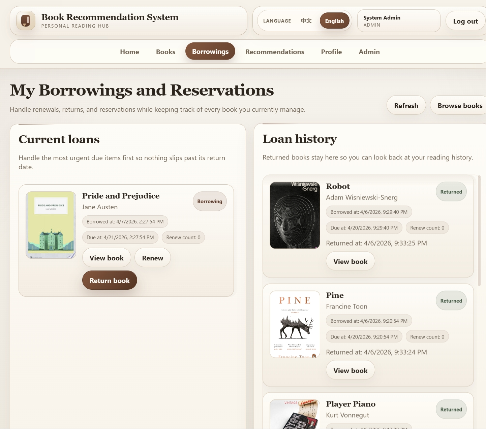

# ReadSeek

> AI 驱动的阅读资源发现系统：图书馆藏管理、混合检索、向量召回、重排序、RAG 问答、智能找书、可解释推荐、行为分析、离线评测与 Rust 基准测试工具。

ReadSeek 不是传统图书管理系统，而是一个面向“阅读资源发现”的完整 AI 应用。系统以 Spring Boot 后端为核心，结合 PostgreSQL、Elasticsearch、Redis、BGE-M3 向量模型、BGE reranker、本地 Ollama 大模型、Vue 3 前端和 Rust 评测 CLI，实现从馆藏数据补全、搜索推荐、RAG 问答到评测报告展示的完整闭环。

当前版本已经完成：

- 373 本演示馆藏的 AI 元数据补全与搜索索引重建。
- 精确匹配、BM25、BGE-M3 向量召回、混合召回、BGE reranker 四路检索。
- 基于馆藏证据的 RAG QA 和 AI 阅读助手。
- 智能找书、自然语言推荐、引用证据卡片、推荐理由和限制说明。
- 推荐货架、相似推荐、用户行为日志、点击和反馈分析。
- 100 条检索评测、60 个 RAG 问题集、推荐离线评测、API 压测。
- Rust 版 `readseek-bench-rs` 基准测试工具。
- 静态 HTML 评测 Dashboard，可调用本地模型分析并使用 `qwen2.5-coder:7b` 生成独立 HTML 报告。

## Screenshots

| Home | Search | Recommendation |
| --- | --- | --- |
|  |  |  |

| Book Detail | Borrowing Records | Swagger |
| --- | --- | --- |
|  |  |  |

## Core Features

### 1. Hybrid Retrieval

ReadSeek 的检索链路不是单一关键词搜索，而是完整的多阶段召回与排序：

- PostgreSQL 精确匹配和基础字段兜底。
- Elasticsearch BM25 全文检索。
- BGE-M3 embedding 向量召回。
- exact / BM25 / vector 候选合并。
- BGE reranker 重排序。
- 查询意图识别、候选数、召回来源、是否 fallback、排序理由可视化。

已暴露的对比接口：

```text
GET /api/search/resources/bm25
GET /api/search/resources/vector
GET /api/search/resources/hybrid-basic
GET /api/search/resources
```

### 2. Evidence-grounded RAG QA

RAG 问答严格基于当前馆藏元数据、简介、标签、分类、作者和检索证据：

- `fast / standard / expert` 三种模式。
- 引用编号、证据卡片、证据来源、reranker 标识。
- answerable 判断、limitations、follow-up suggestions。
- 检索耗时、生成耗时、总耗时记录。
- 证据不足时不编造馆藏外事实。

### 3. AI Reading Assistant

AI 阅读助手支持类似 ChatGPT 的多轮体验，但回答优先受馆藏证据约束：

- 多轮 session。
- 每轮记录证据、推荐图书和策略。
- 支持阅读建议、找书、比较、阅读路径规划。
- 可切换本地 Ollama 模型。

### 4. Explainable Recommendation

推荐模块强调“为什么推荐”：

- 首页推荐货架。
- 相似图书推荐。
- 基于分类、标签、作者、简介和行为数据的解释。
- 曝光、点击、反馈日志。
- 推荐漏斗、CTR、反馈率等管理端分析。

### 5. AI Catalog Enrichment

项目提供本地脚本，支持调用 OpenAI-compatible API 批量补全馆藏信息：

- 简介。
- 标签。
- 搜索关键词。
- 目标读者。
- 难度。
- 推荐理由。
- 置信度。

已经完成一次全量补全、人工校正并写入数据库，随后重建搜索索引：

```text
Indexed catalog resources: 373
```

### 6. Evaluation and Benchmark

项目内置完整评测资产：

- `docs/evaluation/search_queries_100.json`
- `docs/evaluation/rag_questions_60.json`
- Python 评测脚本。
- Rust 评测 CLI。
- Markdown、CSV、JSON、HTML 报告。
- 静态 Dashboard 和本地 AI 辅助分析。

## Final Benchmark Snapshot

以下指标来自 `readseek-bench-rs` 对当前 373 本馆藏和真实运行服务的评测。

### Retrieval: 100 Queries

| Method | Success | Precision@5 | Recall@5 | MRR | NDCG@10 | Avg ms | P95 ms |
| --- | ---: | ---: | ---: | ---: | ---: | ---: | ---: |
| BM25 | 100/100 | 0.3080 | 0.1904 | 0.6440 | 0.3568 | 42.6 | 78.8 |
| Hybrid | 100/100 | 0.3460 | 0.2017 | 0.7043 | 0.3922 | 110.9 | 142.9 |
| Vector | 100/100 | 0.4940 | 0.2536 | 0.8884 | 0.5078 | 62.0 | 73.3 |
| Hybrid + Reranker | 100/100 | 0.5040 | 0.2630 | 0.9167 | 0.5035 | 266.2 | 316.9 |

结论：`hybrid_reranker` 的 Precision@5 和 MRR 最优，适合正式推荐与高质量检索场景；`vector` 速度和排序质量均衡，适合快速检索档。

### RAG: 60 Questions

| Metric | Value |
| --- | ---: |
| Answerable rate | 1.0000 |
| Evidence hit rate | 0.8167 |
| Mean evidence recall | 0.6444 |
| Mean citation coverage | 0.7933 |
| Average total latency | 25555.0 ms |

### Recommendation Offline Evaluation

| Metric | Value |
| --- | ---: |
| Overview cases | 120 |
| Similar recommendation cases | 25 |
| Precision@10 | 0.1731 |
| Recall@10 | 0.1039 |
| NDCG@10 | 0.1939 |

### API Load Test

| Scope | Success rate | Avg ms | P50 | P90 | P95 | P99 | Max |
| --- | ---: | ---: | ---: | ---: | ---: | ---: | ---: |
| Overall | 1.0000 | 630.0 | 103.5 | 1269.7 | 1405.3 | 1562.8 | 1694.8 |
| Recommendation | 1.0000 | 67.2 | 65.1 | 75.3 | 102.1 | 103.5 | 103.5 |
| Search | 1.0000 | 1192.8 | 1202.6 | 1405.3 | 1492.3 | 1694.8 | 1694.8 |

## Architecture

```text
Vue 3 Frontend :5173
        |
        v
Spring Boot API :8010/readseek-service
        |
        +--> PostgreSQL :5043
        |       catalog, users, borrowing, ratings, behavior logs
        |
        +--> Elasticsearch :9200
        |       BM25 retrieval and indexed catalog documents
        |
        +--> Redis :6379
        |       cache and runtime support
        |
        +--> Python AI Service :8001
        |       BGE-M3 embeddings
        |       BGE reranker
        |
        +--> Ollama :11434
                qwen2.5:7b
                qwen3:8b
                qwen3:14b
                qwen2.5-coder:7b
```

## Tech Stack

| Layer | Stack |
| --- | --- |
| Backend | Java 17, Spring Boot 3.5, Spring Security JWT, Spring Data JPA, Spring Data Elasticsearch, Redis, Liquibase |
| Database | PostgreSQL 16 |
| Search | Elasticsearch 8, BM25, BGE-M3 vector recall, BGE reranker |
| AI Service | Python 3.11, FlagEmbedding, BGE-M3, BGE reranker |
| LLM | Ollama local models, optional OpenAI-compatible provider |
| Frontend | Vue 3, Vite, TypeScript, Pinia, Vue Router, Element Plus, ECharts |
| Benchmark | Python scripts, Rust CLI, CSV/JSON/Markdown/HTML reports |
| DevOps | Docker Compose, Maven Wrapper, GitHub Actions |

## Repository Layout

```text
.
├── src/                         # Spring Boot backend
├── frontend/                    # Vue 3 frontend
├── ai-service/                  # Python BGE-M3 embedding/reranker service
├── scripts/                     # startup, enrichment, evaluation, report scripts
├── docs/evaluation/             # 100 queries, 60 RAG questions, generated reports
├── readseek-bench-rs/           # Rust benchmark CLI
├── docker-compose.yml           # PostgreSQL, Elasticsearch, Redis, app
├── pom.xml                      # backend build
└── README.md
```

## Prerequisites

Recommended environment:

- Windows 10/11
- Docker Desktop
- JDK 17
- Python 3.11
- Node.js 22+
- Rust toolchain, for `readseek-bench-rs`
- Ollama

Recommended local Ollama models:

```powershell
ollama pull qwen2.5:7b
ollama pull qwen3:8b
ollama pull qwen3:14b
ollama pull qwen2.5-coder:7b
```

The dashboard can also use these models if installed:

```text
llama3.2:3b
phi4-mini-reasoning
openbmb/minicpm-v4.6
```

## Quick Start

### 1. Clone

```powershell
git clone https://github.com/<your-name>/<your-repo>.git
cd new-book-recommendation-system
```

### 2. Prepare Local Configuration

The repository includes `.env.example`. Real `.env` is ignored by Git.

```powershell
Copy-Item .env.example .env
notepad .env
```

Important values:

```env
POSTGRES_PASSWORD=your-local-password
SPRING_DATASOURCE_PASSWORD=your-local-password
LIBRARY_SECURITY_JWT_SECRET=replace-with-a-long-random-secret
LIBRARY_BOOTSTRAP_ADMIN_EMAIL=admin@booknook.local
LIBRARY_BOOTSTRAP_ADMIN_PASSWORD=your-admin-password
LIBRARY_BOOTSTRAP_ADMIN_RESET_PASSWORD=true
```

Do not commit `.env`.

### 3. Start Everything

```powershell
.\start-readseek.bat
```

The launcher starts:

- Docker dependencies: PostgreSQL, Elasticsearch, Redis.
- Python AI service.
- Spring Boot backend.
- Vue frontend.

Open:

```text
Frontend:       http://127.0.0.1:5173/
Search page:    http://127.0.0.1:5173/search
Swagger UI:     http://localhost:8010/readseek-service/swagger-ui/index.html
Backend health: http://localhost:8010/readseek-service/actuator/health
AI health:      http://127.0.0.1:8001/health
```

### 4. Rebuild Search Index

After importing or enriching catalog data:

```powershell
.\scripts\rebuild-search-index.ps1
```

Expected successful result:

```json
{
  "success": true,
  "message": "Book search index rebuilt successfully.",
  "body": {
    "indexedCount": 373
  }
}
```

## Frontend Routes

| Route | Purpose |
| --- | --- |
| `/login` | Login |
| `/register` | Register |
| `/` | Home dashboard |
| `/books` | Catalog browsing |
| `/books/:id` | Book detail |
| `/search` | Hybrid search and intelligent book finding |
| `/rag` | Evidence-grounded RAG QA |
| `/ai-chat` | Multi-turn AI reading assistant |
| `/recommendations` | Recommendation shelves |
| `/borrowings` | Borrowing records |
| `/planning` | Reading plan |
| `/profile` | User profile and preferences |
| `/management` | Resource management |
| `/admin` | Analytics and admin dashboard |
| `/evaluation` | Evaluation report page |

## Important APIs

### Search

```text
GET  /api/search/resources
GET  /api/search/resources/bm25
GET  /api/search/resources/vector
GET  /api/search/resources/hybrid-basic
POST /api/search/index/books/rebuild
```

### RAG QA

```text
POST /api/qa/evidence
POST /api/qa/citation-click
GET  /api/qa/analytics
GET  /api/qa/events/recent
```

### AI Chat

```text
POST   /api/ai-chat/message
GET    /api/ai-chat/sessions
GET    /api/ai-chat/sessions/{id}
DELETE /api/ai-chat/sessions/{id}
```

### Recommendation

```text
GET  /api/resources/recommendations/overview
GET  /api/resources/recommendations/similar/{id}
POST /api/recommendation-events/click
POST /api/recommendation-events/feedback
GET  /api/recommendation-events/analytics
```

## AI Catalog Enrichment

The enrichment script can call an OpenAI-compatible API to generate catalog metadata.

Preview mode:

```powershell
.\.venv-ai\Scripts\python.exe scripts\enrich_catalog_ai.py `
  --ai-base-url https://dashscope.aliyuncs.com/compatible-mode/v1 `
  --ai-model qwen3.5-omni-plus-2026-03-15 `
  --ai-api-key-env DASHSCOPE_API_KEY `
  --limit 5
```

Apply from a corrected preview:

```powershell
.\.venv-ai\Scripts\python.exe scripts\enrich_catalog_ai.py `
  --input-preview scripts\generated\catalog_ai_enrichment_all_preview_corrected.json `
  --output scripts\generated\catalog_ai_enrichment_all_apply_result.json `
  --min-apply-confidence 0.0 `
  --apply `
  --rebuild-index
```

The script intentionally supports dry-run and preview correction before writing to the database.

## Python Evaluation Scripts

Generate evaluation assets:

```powershell
.\.venv-ai\Scripts\python.exe scripts\generate_evaluation_assets.py
```

Run four-way retrieval evaluation:

```powershell
.\.venv-ai\Scripts\python.exe scripts\run_retrieval_evaluation.py `
  --queries docs/evaluation/search_queries_100.json `
  --output-dir docs/evaluation/generated `
  --limit 10
```

Run RAG evaluation:

```powershell
.\.venv-ai\Scripts\python.exe scripts\run_rag_evaluation.py `
  --questions docs/evaluation/rag_questions_60.json `
  --output-dir docs/evaluation/generated `
  --mode standard `
  --provider ollama `
  --limit 8
```

Run recommendation evaluation:

```powershell
.\.venv-ai\Scripts\python.exe scripts\run_recommendation_offline_evaluation.py `
  --queries docs/evaluation/search_queries_100.json `
  --output-dir docs/evaluation/generated
```

Run API load test:

```powershell
.\.venv-ai\Scripts\python.exe scripts\run_api_load_test.py `
  --scenarios search,recommendation `
  --requests 100 `
  --concurrency 8 `
  --output-dir docs/evaluation/generated
```

## Rust Benchmark CLI

`readseek-bench-rs` is a standalone Rust CLI. It reuses the same evaluation data and APIs as the Python scripts, but provides a typed, distributable benchmark tool.

Run the full suite:

```powershell
.\scripts\run_readseek_bench_rs_suite.ps1
```

Run retrieval only:

```powershell
.\scripts\run_readseek_bench_rs.ps1
```

Open the static benchmark dashboard:

```powershell
.\scripts\serve_readseek_report.ps1
```

Then open:

```text
http://127.0.0.1:8765/index.html
```

Dashboard capabilities:

- Shows retrieval, RAG, recommendation and load-test metrics.
- Displays quality bars, latency charts, RAG circular indicators and quality-first modeling score.
- Can call a local analysis model such as `qwen2.5:7b`, `qwen3:8b` or `qwen3:14b`.
- Can call `qwen2.5-coder:7b` to generate a standalone HTML report.
- Provides live preview and download for the generated HTML.

If the browser blocks direct access to Ollama, configure local origins and restart Ollama:

```powershell
$env:OLLAMA_ORIGINS="*"
ollama serve
```

## Testing

Backend tests:

```powershell
.\mvnw-jdk17.cmd test
```

Frontend build:

```powershell
cd frontend
npm install
npm run build
```

Rust benchmark tests:

```powershell
cd readseek-bench-rs
cargo test
```

Docker Compose validation:

```powershell
docker compose config --quiet
```

## Stop Local Services

If started with the project scripts, close the spawned terminals or stop by port/process. Docker dependencies can be stopped with:

```powershell
docker compose stop db elasticsearch redis
```

If the static report server is running, stop the terminal running:

```powershell
.\scripts\serve_readseek_report.ps1
```

## GitHub Notes

Before publishing:

1. Ensure `.env` is not committed.
2. Remove or ignore runtime logs such as `*.log`.
3. Keep `docs/evaluation/generated/` only if you want to publish measured benchmark artifacts.
4. Keep screenshots in the repository root if you want them displayed in this README.
5. Run backend, frontend and Rust tests once before pushing.

Useful checks:

```powershell
.\mvnw-jdk17.cmd test
cd frontend
npm run build
cd ..
cd readseek-bench-rs
cargo test
```

## Current Scope and Boundaries

ReadSeek is designed around catalog-level reading resources, not full-book text ingestion.

Currently included:

- Catalog metadata, descriptions, tags, categories, authors and publisher fields.
- Search and RAG over resource metadata and summaries.
- Evidence-grounded answers and recommendations.
- Evaluation on the current 373-book demo catalog.

Currently not included:

- Full PDF/EPUB chapter ingestion.
- Chapter-level QA.
- Copyrighted full-text indexing.
- Large public recommendation datasets such as Goodreads.
- Production multi-node deployment.

## Project Status

This version is a complete portfolio/course-project release:

- Full-stack application.
- AI-enhanced catalog.
- Hybrid retrieval and RAG.
- Explainable recommendation.
- Admin analytics.
- Modern Vue UI.
- Python and Rust evaluation toolchains.
- Reproducible reports and static benchmark dashboard.

ReadSeek can be presented as a mature AI reading-resource discovery system and as an engineering case study for retrieval, recommendation, RAG and evaluation.
