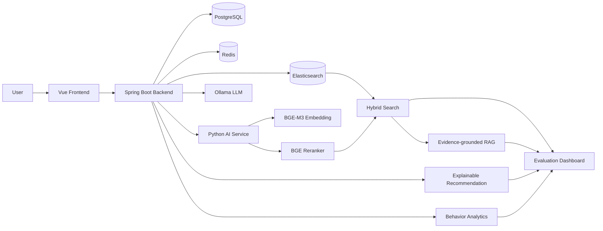

# ReadSeek Architecture

## 1. System Positioning

ReadSeek is not a traditional library management system. Its core goal is to improve reading-resource discovery through hybrid retrieval, evidence-grounded RAG, explainable recommendation, behavior analytics, and offline evaluation.

The system is designed as an undergraduate engineering-oriented AI application. It focuses on a complete and reproducible engineering workflow rather than original model research.

## 2. Overall Architecture



The system consists of four main layers:

1. Frontend Layer: Vue-based user interface for search, RAG QA, recommendation, management, and analytics.
2. Backend Layer: Spring Boot service responsible for authentication, business orchestration, API routing, search strategy selection, recommendation, and event logging.
3. Retrieval and Data Layer: PostgreSQL for structured catalog data, Redis for cache and deduplication, and Elasticsearch for BM25, vector retrieval, and hybrid search.
4. AI Service Layer: Python service for BGE-M3 embedding and BGE reranking, plus Ollama local LLM service for evidence-grounded answer generation.

## 3. Core Data Flow

### 3.1 Hybrid Search Flow

```text
User query
  -> query normalization
  -> intent and strategy decision
  -> exact DB match / BM25 recall / vector recall
  -> candidate merge and deduplication
  -> BGE reranker
  -> final ranked result list
  -> search result explanation
```

The result returned to the frontend includes not only books, but also query intent, strategy, recall source, rerank information, fallback state, score, and explanation.

### 3.2 RAG QA Flow

```text
User question
  -> hybrid retrieval
  -> reranking
  -> evidence selection
  -> prompt construction
  -> local LLM generation
  -> answer with cited book evidence
  -> evidence cards and limitations
```

The LLM is expected to answer from retrieved catalog evidence. If evidence is insufficient, the answer should be conservative and state the limitation.

### 3.3 Recommendation Flow

```text
User profile and behavior
  -> content-based recall / similar-resource recall / popularity fallback
  -> fusion ranking
  -> source-bound recommendation reason
  -> recommendation display
  -> exposure, click, and feedback logging
```

Recommendation explanations are bound to real sources such as content similarity, category/tag overlap, popularity, recent search intent, or user behavior. The model may polish wording, but should not invent unsupported reasons.

### 3.4 Evaluation Flow

```text
Evaluation datasets
  -> ReadSeek API calls
  -> retrieval / RAG / recommendation / load metrics
  -> Markdown, CSV, JSON reports
  -> static HTML dashboard
  -> local AI-assisted analysis
```

The Rust CLI `readseek-bench-rs` is used to generate reproducible evaluation evidence for the final project version.

## 4. Key Design Decisions

### 4.1 Why Hybrid Retrieval

Exact search is suitable for title, author, ISBN, and metadata queries. BM25 is effective for keyword matching. Dense vector retrieval is useful for natural-language and semantic queries. ReadSeek combines them to improve robustness across different query types.

### 4.2 Why Reranking

Hybrid retrieval can bring more candidates into the result set, but the top order may still be noisy. BGE reranker re-evaluates query-document relevance and improves top-ranked result quality.

### 4.3 Why Evidence-grounded RAG

The system does not allow the LLM to answer freely without book evidence. RAG answers are generated from retrieved book records, descriptions, tags, categories, authors, and other catalog metadata.

### 4.4 Why Source-bound Recommendation Explanation

Recommendation explanations are tied to actual recommendation sources. This makes the recommendation page easier to understand and helps distinguish the system from opaque recommendation lists.

## 5. Deployment Mode

ReadSeek supports local deployment with:

- Vue frontend
- Spring Boot backend
- PostgreSQL
- Redis
- Elasticsearch
- Python BGE-M3 AI service
- Ollama local LLM service
- Rust evaluation CLI and static dashboard

This deployment mode is intended for local demonstration, undergraduate project defense, and reproducible engineering evaluation. Production deployment would require stronger security, model service orchestration, monitoring, and access control.
