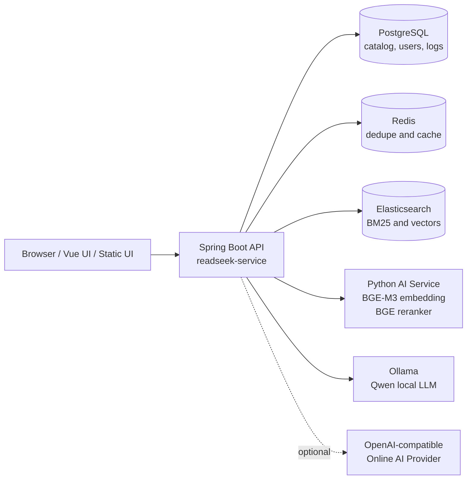
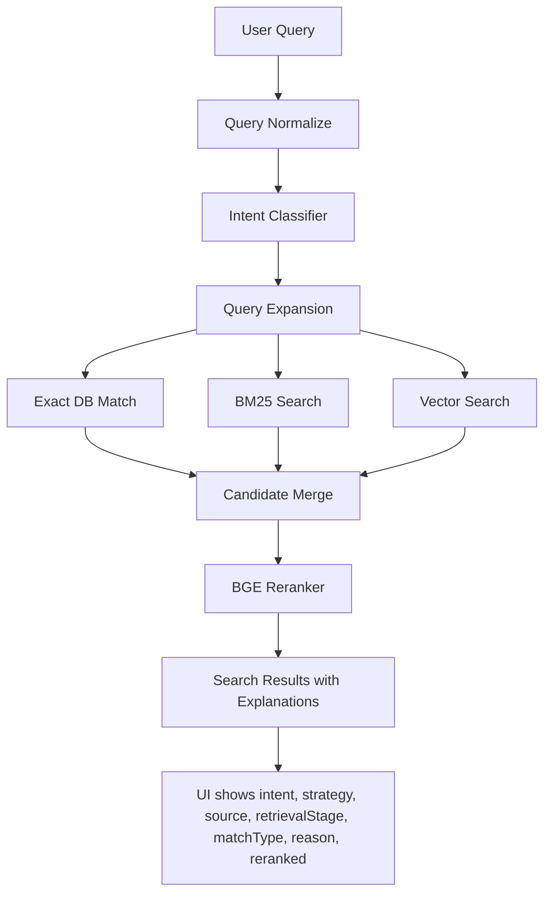
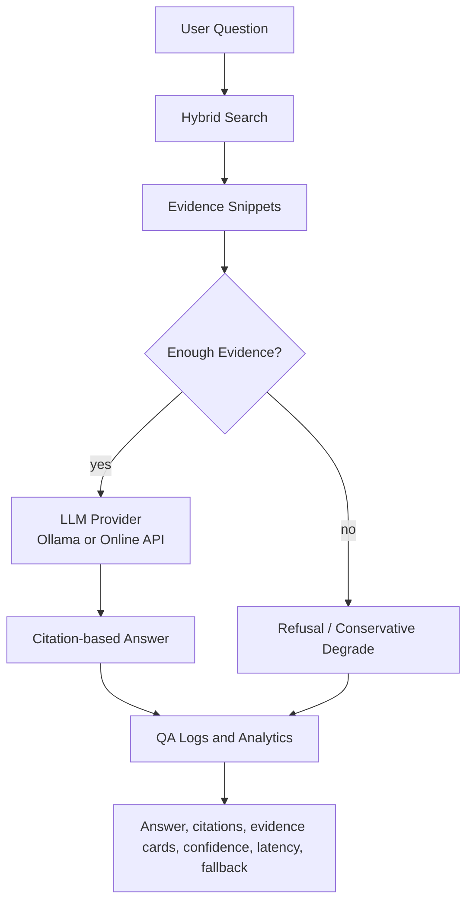
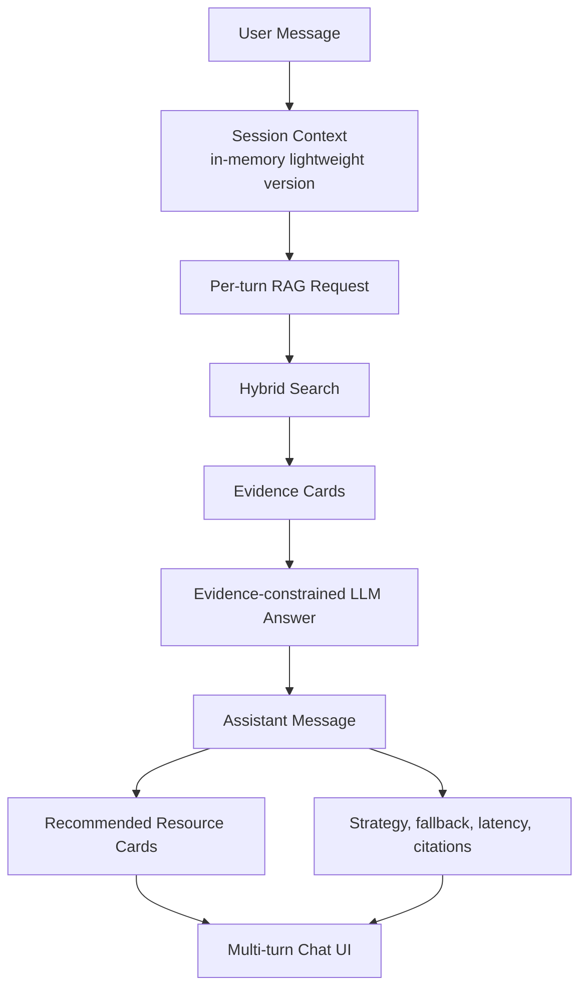
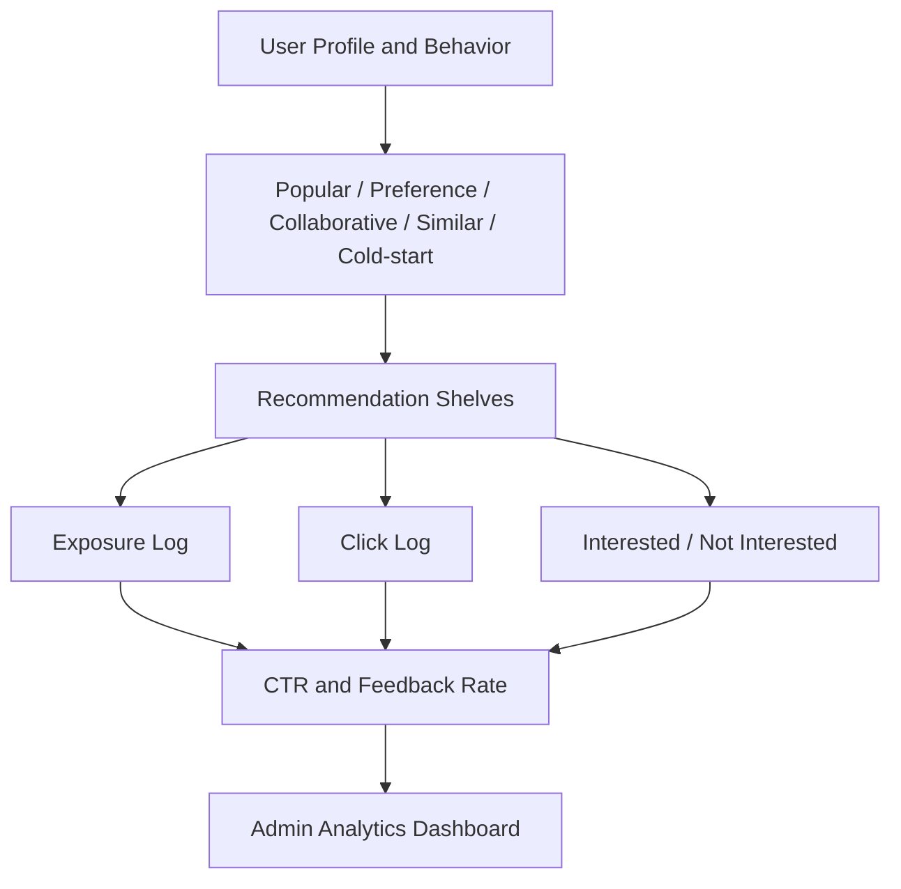

# ReadSeek Architecture and Flows

This document uses Mermaid diagrams so GitHub can render the architecture directly from Markdown.

## System Architecture

## Hybrid Search Flow

## RAG Question Answering Flow

## AI Reading Assistant Flow

## Recommendation Analytics Flow

## Current Non-goals

- No full-text book ingestion.
- No chapter-level knowledge base.
- No deep chapter-specific QA.
- No production-scale retrieval benchmark.
- No complex Learning-to-Rank model training.
